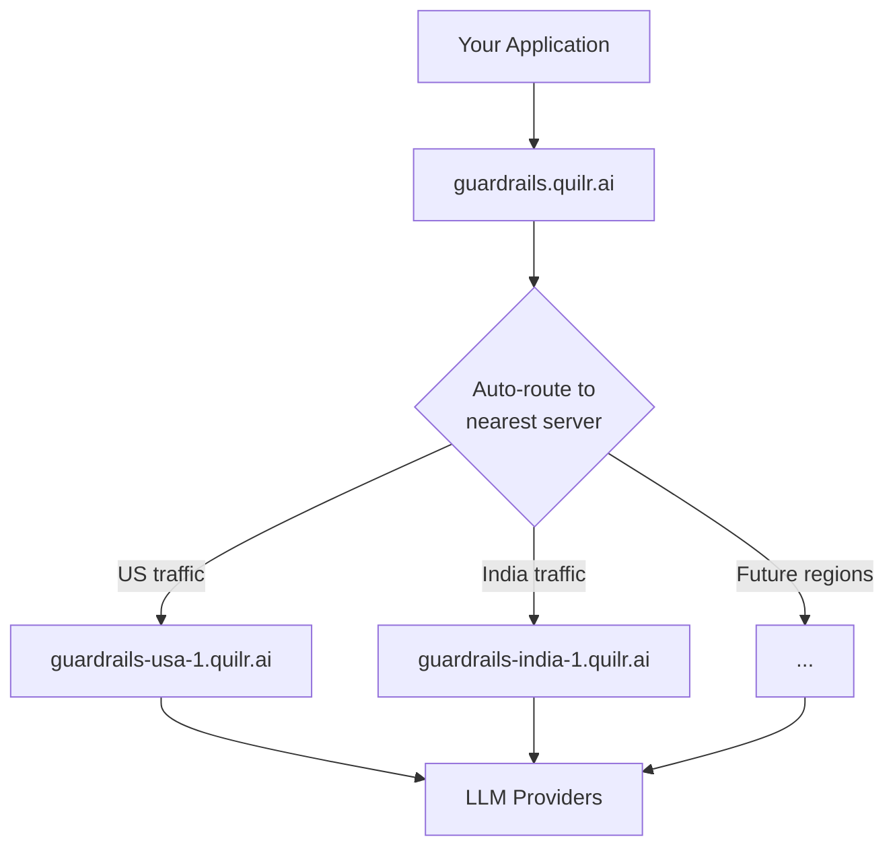

# HA & SLA

High availability endpoints, retry strategy, and latency guarantees for the QuilrAI LLM Gateway.

## Gateway Endpoints

All endpoints are fully interchangeable - same API surface, same features, same API keys. The only difference is geographic proximity to your application.

| Endpoint | Region | Base URL |
|----------|--------|----------|
| **Global (auto-routed)** | Nearest | `https://guardrails.quilr.ai` |
| **USA** | US East | `https://guardrails-usa-1.quilr.ai` |
| **India** | Mumbai | `https://guardrails-india-1.quilr.ai` |

Append the API format path to any base URL - for example, `https://guardrails-usa-1.quilr.ai/openai_compatible/`. See the [Integration Guide](./integration-guide) for all supported formats.

:::info Expanding regions
This list will continue to grow as we bring new regions online. Check this page or the [Integration Guide](./integration-guide) for the latest endpoints.
:::

## Routing Architecture

When you send a request to `guardrails.quilr.ai`, it automatically routes to the nearest available gateway server based on your geographic location. No configuration needed.



Each regional server runs the full QuilrAI pipeline - validation, scanning, transformation, routing, and observability - so there is no functional difference between endpoints.

## Recommended Retry Strategy

<StepFlow steps={[
  {
    label: "Attempt 1",
    items: [
      "→ guardrails.quilr.ai",
      "Auto-routes to nearest ✓",
      "Optimal latency ✓",
    ],
  },
  {
    label: "Attempt 2",
    items: [
      "→ guardrails-usa-1.quilr.ai",
      "Direct to US server ✓",
      "Bypasses auto-routing ✓",
    ],
  },
  {
    label: "Attempt 3",
    items: [
      "→ guardrails-india-1.quilr.ai",
      "Direct to India server ✓",
      "Geographic redundancy ✓",
    ],
  },
]} />

Even though `guardrails.quilr.ai` auto-routes to the nearest healthy server, we recommend a three-tier retry strategy that falls back to explicit regional endpoints:

1. **First attempt** - `guardrails.quilr.ai` - Uses auto-routing for optimal latency under normal conditions.
2. **Second attempt** - `guardrails-usa-1.quilr.ai` - Direct connection to the US server, bypassing the auto-routing layer entirely.
3. **Third attempt** - `guardrails-india-1.quilr.ai` - Targets a geographically distinct server for maximum redundancy.

### Why retry with regional endpoints?

Auto-routing handles most failure scenarios transparently. However, explicit regional fallbacks protect against edge cases that auto-routing alone cannot cover:

- **DNS or routing-layer issues** - If the global endpoint's routing layer itself is degraded, direct regional URLs bypass it entirely.
- **Auto-routing detection latency** - The auto-router takes 3-7 seconds to detect a downed host. During this window, your request may still be routed to the unhealthy server. Retrying with an explicit regional URL immediately targets a different host, avoiding the detection delay.
- **Regional propagation delays** - A server that has just recovered may not yet be visible to the auto-router. Hitting it directly avoids propagation lag.
- **Geographic redundancy** - Retrying across regions ensures your request reaches an entirely independent infrastructure stack, eliminating single points of failure.

The overhead is minimal - two additional fallback URLs in your retry logic - but the resilience improvement is significant.

We recommend **one retry per QuilrAI host**. If a request fails on a given endpoint, move on to the next one rather than retrying the same host. This maximizes the chance of hitting a healthy server quickly, especially during the 3-7 second window before auto-routing detects a failure.

### Code Example

```python
import time
import httpx

ENDPOINTS = [
    "https://guardrails.quilr.ai",           # auto-routes to nearest
    "https://guardrails-usa-1.quilr.ai",      # direct US fallback
    "https://guardrails-india-1.quilr.ai",    # direct India fallback
]

def call_llm(payload: dict) -> dict:
    for base_url in ENDPOINTS:
        try:
            resp = httpx.post(
                f"{base_url}/openai_compatible/v1/chat/completions",
                headers={"Authorization": "Bearer sk-quilr-xxx"},
                json=payload,
                timeout=30,
            )
            resp.raise_for_status()
            return resp.json()
        except (httpx.RequestError, httpx.HTTPStatusError):
            time.sleep(0.3)  # optionally sleep slightly before retrying the next host
            continue
    raise RuntimeError("All gateway endpoints failed")
```

```python
import time
from openai import OpenAI

ENDPOINTS = [
    "https://guardrails.quilr.ai/openai_compatible/v1",        # auto-routes to nearest
    "https://guardrails-usa-1.quilr.ai/openai_compatible/v1",   # direct US fallback
    "https://guardrails-india-1.quilr.ai/openai_compatible/v1", # direct India fallback
]

def call_llm(messages: list) -> str:
    for base_url in ENDPOINTS:
        try:
            client = OpenAI(base_url=base_url, api_key="sk-quilr-xxx")
            response = client.chat.completions.create(
                model="gpt-4o",
                messages=messages,
            )
            return response.choices[0].message.content
        except Exception:
            time.sleep(0.3)  # optionally sleep slightly before retrying the next host
            continue
    raise RuntimeError("All gateway endpoints failed")
```

```javascript
const ENDPOINTS = [
  "https://guardrails.quilr.ai",           // auto-routes to nearest
  "https://guardrails-usa-1.quilr.ai",     // direct US fallback
  "https://guardrails-india-1.quilr.ai",   // direct India fallback
];

async function callLLM(payload) {
  for (const baseUrl of ENDPOINTS) {
    try {
      const res = await fetch(
        `${baseUrl}/openai_compatible/v1/chat/completions`,
        {
          method: "POST",
          headers: {
            "Content-Type": "application/json",
            Authorization: "Bearer sk-quilr-xxx",
          },
          body: JSON.stringify(payload),
        }
      );
      if (!res.ok) throw new Error(res.statusText);
      return await res.json();
    } catch {
      await new Promise((r) => setTimeout(r, 300)); // optionally sleep slightly before retrying the next host
      continue;
    }
  }
  throw new Error("All gateway endpoints failed");
}
```

## Data Residency Note

:::info Only LLM requests are routed across regions
When a request is routed to a different regional endpoint (either by auto-routing or your retry logic), **only the LLM API call itself** is forwarded to that region's gateway server. All other data - request logs, analytics, guardrail audit trails, prompt history, and dashboard metrics - remains stored in your account's primary region. Cross-region routing does not replicate or move any of your logged data to another geography.
:::

## SLA

### Uptime

QuilrAI guarantees **99.6% uptime** across all gateway endpoints. This is measured as the combined availability of the global and regional endpoints. With the recommended retry strategy across multiple hosts, effective availability from your application's perspective is significantly higher.

### Gateway Latency

The QuilrAI gateway adds **~40 ms** of processing latency for a typical 12,000-token request. This covers the full pipeline - authentication, guardrail scanning, transformation, routing, and logging.

| Metric | Value |
|--------|-------|
| **Gateway overhead** | ~40 ms per 12,000 tokens |
| **Overhead source** | Auth + guardrails + routing + logging |
| **LLM response time** | Improved by 2-5% due to server-side connection optimizations |

Gateway latency scales with token count. Shorter requests are faster; longer requests proportionally slower.

### Connection Pooling & Performance Under Load

The QuilrAI gateway maintains persistent connection pools to all configured LLM providers. This delivers meaningful performance benefits, especially under high concurrency:

- **Eliminates per-request TLS handshakes** - Connections to providers like OpenAI and Anthropic are kept warm, removing the 50-150 ms of handshake overhead that each cold connection would otherwise incur.
- **Reduces provider-side throttling** - Pooled connections present a stable, predictable traffic pattern that is less likely to trigger provider rate limits compared to bursts of new connections from distributed clients.
- **Handles connection backpressure** - Under high concurrency, the gateway queues and multiplexes requests across the pool rather than opening unbounded connections that providers may reject.
- **Centralized provider credentials** - A single connection pool per provider key avoids the "thundering herd" problem where many application instances each independently compete for connections.

For latency-sensitive workloads, the gateway's pooling layer can reduce effective end-to-end latency below what a direct provider connection achieves - particularly during traffic spikes when cold-start connection costs dominate.
